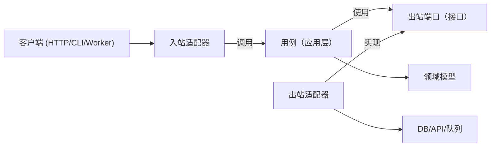

# 六边形架构

六边形架构（端口和适配器）使业务逻辑独立于框架、传输和持久化细节。核心应用依赖于抽象端口，适配器在边缘实现这些端口。

## 何时使用

- 构建新功能，其中长期可维护性和可测试性很重要。
- 重构分层或框架繁重的代码，其中领域逻辑与 I/O 关注点混合。
- 支持同一用例的多个接口（HTTP、CLI、队列 worker、cron 作业）。
- 替换基础设施（数据库、外部 API、消息总线）而不重写业务规则。

当请求涉及边界、领域驱动设计、重构紧密耦合的服务或将应用逻辑与特定库解耦时，使用此技能。

## 核心概念

- **领域模型**：业务规则和实体/值对象。无框架导入。
- **用例（应用层）**：编排领域行为和工作流步骤。
- **入站端口**：描述应用可以做什么的契约（命令/查询/用例接口）。
- **出站端口**：应用需要依赖的契约（仓库、网关、事件发布者、时钟、UUID 等）。
- **适配器**：端口的基础设施和交付实现（HTTP 控制器、DB 仓库、队列消费者、SDK 包装器）。
- **组合根**：单一接线位置，在那里具体适配器被绑定到用例。

出站端口接口通常位于应用层（或者仅在抽象真正是领域级时才在领域层），基础设施适配器实现它们。

依赖方向始终向内：

- 适配器 -> 应用/领域
- 应用 -> 端口接口（入站/出站契约）
- 领域 -> 仅领域抽象（无框架或基础设施依赖）
- 领域 -> 无外部依赖

## 工作原理

### 步骤 1：建模用例边界

定义具有清晰输入和输出 DTO 的单一用例。将传输细节（Express `req`、GraphQL `context`、作业有效载荷包装器）保持在此边界之外。

### 步骤 2：先定义出站端口

将每个副作用识别为端口：

- 持久化（`UserRepositoryPort`）
- 外部调用（`BillingGatewayPort`）
- 横切关注点（`LoggerPort`、`ClockPort`）

端口应模型化能力，而非技术。

### 步骤 3：用纯编排实现用例

用例类/函数通过构造函数/参数接收端口。它验证应用级不变量、编排领域规则并返回纯数据结构。

### 步骤 4：在边缘构建适配器

- 入站适配器将协议输入转换为用例输入。
- 出站适配器将应用契约映射到具体 API/ORM/查询构建器。
- 映射保持在适配器中，而非用例内部。

### 步骤 5：在组合根中连接一切

实例化适配器，然后将它们注入用例。保持此接线集中以避免隐藏的服务定位器行为。

### 步骤 6：按边界测试

- 用假端口单元测试用例。
- 用真实基础设施依赖集成测试适配器。
- 通过入站适配器 E2E 测试用户面向的流程。

## 架构图



## 推荐的模块布局

使用特征优先的组织与明确边界：

```text
src/
  features/
    orders/
      domain/
        Order.ts
        OrderPolicy.ts
      application/
        ports/
          inbound/
            CreateOrder.ts
          outbound/
            OrderRepositoryPort.ts
            PaymentGatewayPort.ts
        use-cases/
          CreateOrderUseCase.ts
      adapters/
        inbound/
          http/
            createOrderRoute.ts
        outbound/
          postgres/
            PostgresOrderRepository.ts
          stripe/
            StripePaymentGateway.ts
      composition/
        ordersContainer.ts
```

## TypeScript 示例

### 端口定义

```typescript
export interface OrderRepositoryPort {
  save(order: Order): Promise<void>;
  findById(orderId: string): Promise<Order | null>;
}

export interface PaymentGatewayPort {
  authorize(input: { orderId: string; amountCents: number }): Promise<{ authorizationId: string }>;
}
```

### 用例

```typescript
type CreateOrderInput = {
  orderId: string;
  amountCents: number;
};

type CreateOrderOutput = {
  orderId: string;
  authorizationId: string;
};

export class CreateOrderUseCase {
  constructor(
    private readonly orderRepository: OrderRepositoryPort,
    private readonly paymentGateway: PaymentGatewayPort
  ) {}

  async execute(input: CreateOrderInput): Promise<CreateOrderOutput> {
    const order = Order.create({ id: input.orderId, amountCents: input.amountCents });

    const auth = await this.paymentGateway.authorize({
      orderId: order.id,
      amountCents: order.amountCents,
    });

    // markAuthorized 返回新的 Order 实例；它不是原地变更。
    const authorizedOrder = order.markAuthorized(auth.authorizationId);
    await this.orderRepository.save(authorizedOrder);

    return {
      orderId: order.id,
      authorizationId: auth.authorizationId,
    };
  }
}
```

### 出站适配器

```typescript
export class PostgresOrderRepository implements OrderRepositoryPort {
  constructor(private readonly db: SqlClient) {}

  async save(order: Order): Promise<void> {
    await this.db.query(
      "insert into orders (id, amount_cents, status, authorization_id) values ($1, $2, $3, $4)",
      [order.id, order.amountCents, order.status, order.authorizationId]
    );
  }

  async findById(orderId: string): Promise<Order | null> {
    const row = await this.db.oneOrNone("select * from orders where id = $1", [orderId]);
    return row ? Order.rehydrate(row) : null;
  }
}
```

### 组合根

```typescript
export const buildCreateOrderUseCase = (deps: { db: SqlClient; stripe: StripeClient }) => {
  const orderRepository = new PostgresOrderRepository(deps.db);
  const paymentGateway = new StripePaymentGateway(deps.stripe);

  return new CreateOrderUseCase(orderRepository, paymentGateway);
};
```

## 多语言映射

跨生态系统使用相同的边界规则；仅语法和接线风格改变。

- **TypeScript/JavaScript**
  - 端口：`application/ports/*` 作为接口/类型。
  - 用例：带构造函数/参数注入的类/函数。
  - 适配器：`adapters/inbound/*`、`adapters/outbound/*`。
  - 组合：显式工厂/容器模块（无隐藏全局变量）。
- **Java**
  - 包：`domain`、`application.port.in`、`application.port.out`、`application.usecase`、`adapter.in`、`adapter.out`。
  - 端口：`application.port.*` 中的接口。
  - 用例：普通类（Spring `@Service` 是可选的，非必需）。
  - 组合：Spring 配置或手动接线类；保持接线在领域/用例类之外。
- **Kotlin**
  - 模块/包镜像 Java 分割（`domain`、`application.port`、`application.usecase`、`adapter`）。
  - 端口：Kotlin 接口。
  - 用例：带构造函数注入的类（Koin/Dagger/Spring/手动）。
  - 组合：模块定义或专用组合函数；避免服务定位器模式。
- **Go**
  - 包：`internal/<feature>/domain`、`application`、`ports`、`adapters/inbound`、`adapters/outbound`。
  - 端口：由消费应用包拥有的较小接口。
  - 用例：带接口字段的结构体加上显式 `New...` 构造函数。
  - 组合：在 `cmd/<app>/main.go` 中接线（或专用接线包），保持构造函数显式。

## 应避免的反模式

- 领域实体导入 ORM 模型、Web 框架类型或 SDK 客户端。
- 用例直接从 `req`、`res` 或队列元数据读取。
- 从用例直接返回数据库行而不经过领域/应用映射。
- 让适配器直接相互调用而非通过用例端口流动。
- 通过许多文件分散依赖接线，带隐藏的全局单例。

## 迁移手册

1. 选择一个垂直切片（单一端点/作业），有频繁的变更痛苦。
2. 用显式输入/输出类型提取用例边界。
3. 在现有基础设施调用周围引入出站端口。
4. 将编排逻辑从控制器/服务移到用例。
5. 保留旧适配器，但让它们委托给新的用例。
6. 在新边界周围添加测试（单元 + 适配器集成）。
7. 逐个切片重复；避免全重写。

### 重构现有系统

- **Strangler 方法**：保留当前端点，一次一个用例路由通过新端口/适配器。
- **无大爆炸重写**：按特征切片迁移并通过表征测试保持行为。
- **先 Facade**：在替换内部之前将遗留服务包装在出站端口后面。
- **组合冻结**：尽早集中接线以便新依赖不泄漏到领域/用例层。
- **切片选择规则**：优先选择高变更、低爆炸半径的流程。
- **回滚路径**：在生产行为验证前保持每个迁移切片的可逆切换或路由开关。

## 测试指导（相同的六边形边界）

- **领域测试**：将实体/值对象作为纯业务规则测试（无 mocks，无框架设置）。
- **用例单元测试**：用出站端口的 fakes/stubs 测试编排；断言业务结果和端口交互。
- **出站适配器契约测试**：在端口级别定义共享契约套件并针对每个适配器实现运行。
- **入站适配器测试**：验证协议映射（HTTP/CLI/队列有效载荷到用例输入和输出/错误映射回协议）。
- **适配器集成测试**：针对真实基础设施（DB/API/队列）运行，用于序列化、schema/查询行为、重试和超时。
- **端到端测试**：通过入站适配器 -> 用例 -> 出站适配器覆盖关键用户旅程。
- **重构安全**：提取前添加表征测试；保持它们直到新边界行为稳定且等效。

## 最佳实践检查清单

- 领域和用例层仅导入内部类型和端口。
- 每个外部依赖都用出站端口表示。
- 验证发生在边界（入站适配器 + 用例不变量）。
- 使用不可变转换（返回新值/实体而非变更共享状态）。
- 错误跨边界转换（基础设施错误 -> 应用/领域错误）。
- 组合根是显式的且易于审计。
- 用例可用简单的内存 fakes 测试端口。
- 重构从保留行为的测试的一个垂直切片开始。
- 语言/框架 细节保持在适配器中，绝不在领域规则中。